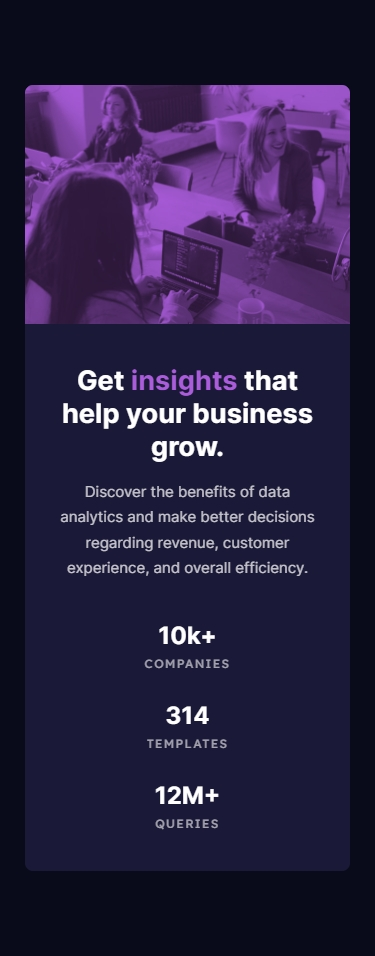

## Frontend Mentor Challenge 05 - Stats Preview Card Component

This is a solution to the [Stats preview card component challenge on Frontend Mentor](https://www.frontendmentor.io/challenges/stats-preview-card-component-8JqbgoU62). Frontend Mentor challenges help you improve your coding skills by building realistic projects. 

### Screenshots of my solution

#

### Links
- Live Site URL: [URL]
- Solution URL: [URL]
#

### Built with
- HTML5 / CSS
- CSS Flexbox
- CSS Grid
#

### New things I learned
- `letter-spacing` CSS property - Adjust the horizontal spacing between letters in a word.
- Using `<picture>` and `<source>` HTML elements to switch between multiple image sources. [w3 schools](https://www.w3schools.com/html/html_images_picture.asp)
#

### Tools I used
- [PerfectPixel by WellDoneCode](https://chromewebstore.google.com/detail/perfectpixel-by-welldonec/dkaagdgjmgdmbnecmcefdhjekcoceebi) - A chrome extension that enables you to overlay an image over your HTML webpage. This makes it easy to compare your HTML result with the reference image and adjust fine details.

- [Responsively.app](https://responsively.app/) - A free and open source tool that allows you to test your webpage on different screen sizes, take screenshots and much more.

- [Web ToolBox - Image Comparison Slider](https://web-toolbox.dev/en/tools/image-compare-slider) - Allows you to compare two images using a slider.
#

- My Frontend Mentor Profile - [@DarkstarXDD](https://www.frontendmentor.io/profile/DarkstarXDD)